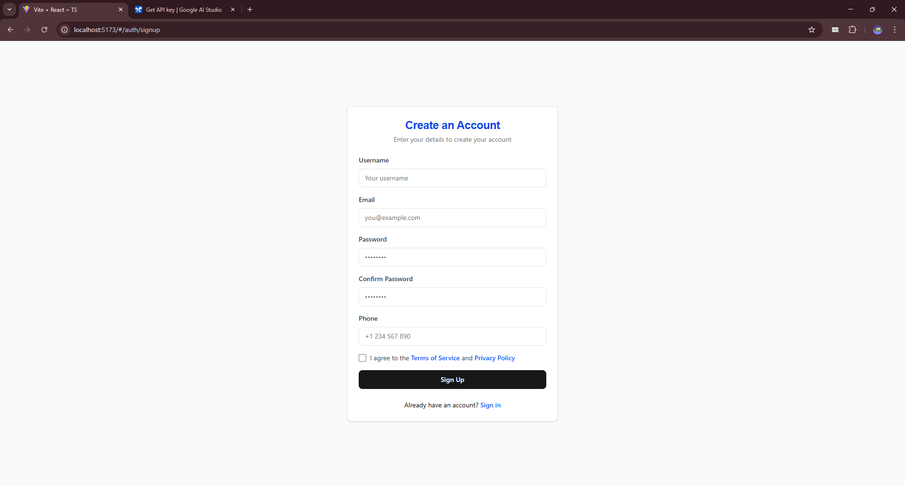
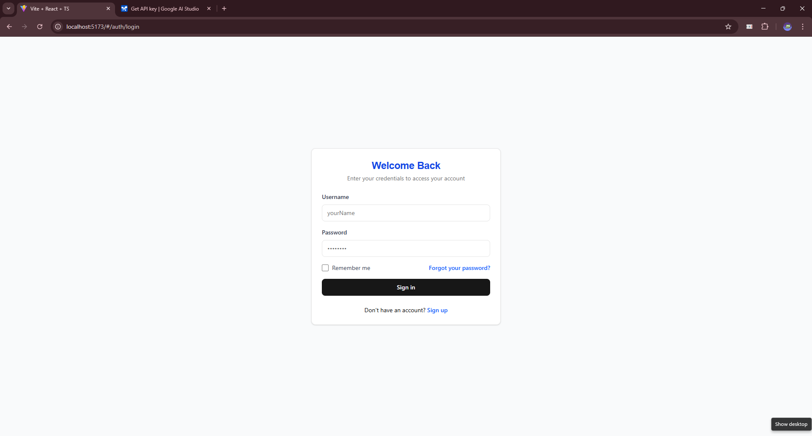
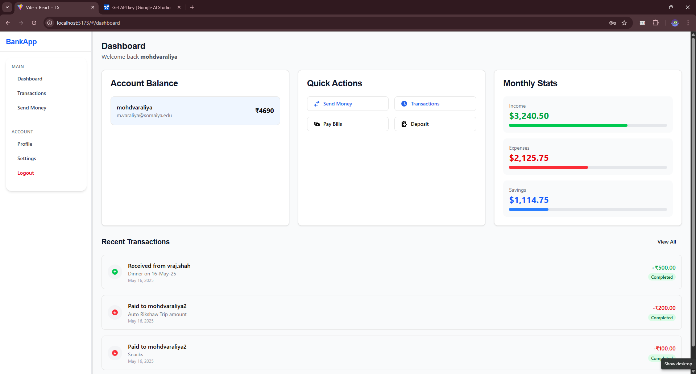
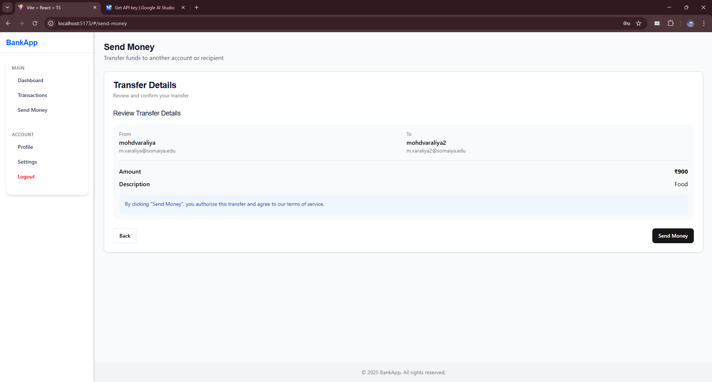
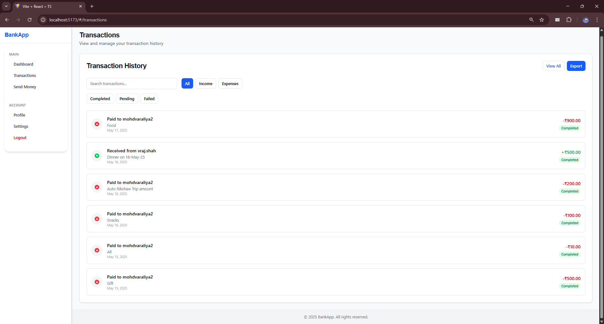
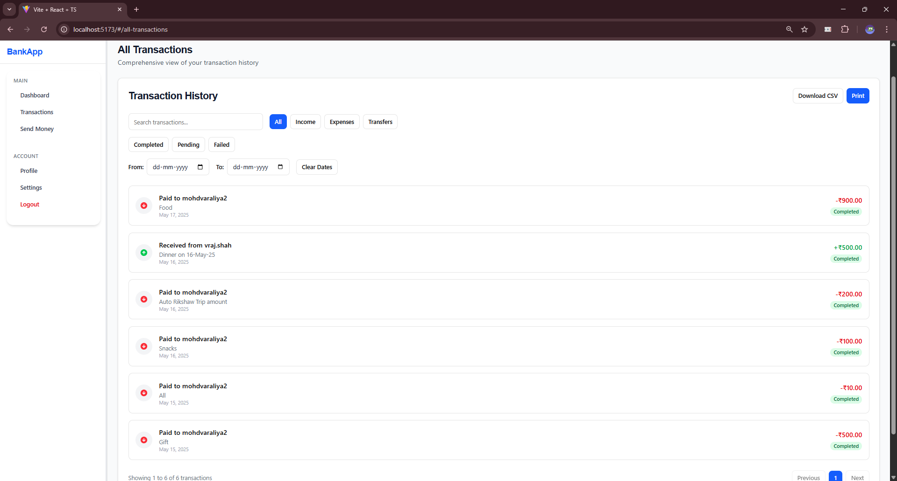
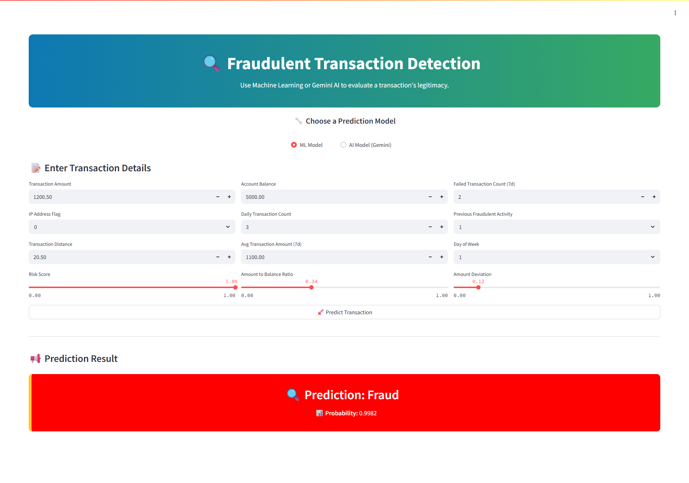
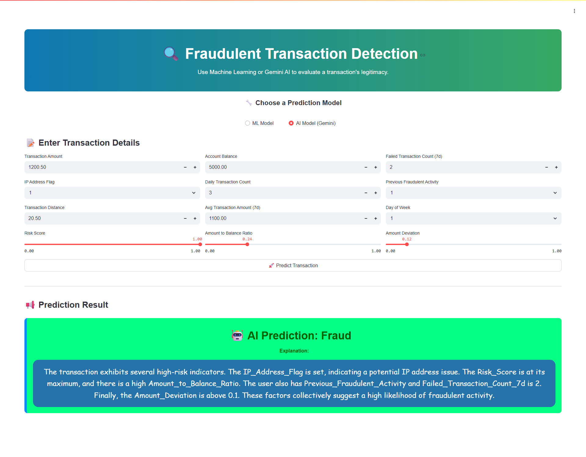

# 💳 Online Banking Application – FinTech Software

An end-to-end **Online Banking System** that mimics real-world banking platforms like ICICI, BOI, or HDFC. This system allows users to securely sign up, authenticate, send/receive money, and visualize transaction history. It also includes an advanced **Fraud Detection System** to identify suspicious transactions based on historical patterns.

---

## 📚 Table of Contents

- [🔧 System Architecture](#-system-architecture)
- [🚀 Features](#-features)
- [📂 Project Structure](#-project-structure)
- [🔐 Authentication & Security](#-authentication--security)
- [📦 Tech Stack](#-tech-stack)
- [🖼️ Application Screenshots](#️-application-screenshots)
- [📊 Fraud Detection System](#-fraud-detection-system)
- [🤝 Contributors](#-contributors)
- [📎 Useful Links](#-useful-links)

---

## 🔧 System Architecture

Before development, we invested several weeks designing a robust architecture covering:

- ✅ Functional & Non-Functional Requirements
- 🧬 High-Level Design (HLD)
- 🛠️ Low-Level Design (LLD)
- 🔄 Sequence Diagrams & Flow Diagrams

📌 **[Design Docs & Diagrams](https://app.eraser.io/workspace/CXMV5NsTickZUMIarl8n?origin=share)**

---

## 🚀 Features

### ✅ Backend (Spring Boot + RabbitMQ)

- JWT-based secure login/signup
- Asynchronous transaction processing via RabbitMQ
- Endpoints for user data, transactions, and token validation
- API weight limiting and pagination support

### 🎨 Frontend (Vite + React + TypeScript)

- Fully responsive & modern UI using TailwindCSS and ShadCN
- Signup/Login, Dashboard, Transaction History
- Money Transfer (Send/Receive) with real-time feedback
- Reusable components and modular code structure

### 🔍 Fraud Detection

- Machine Learning model that predicts fraud based on transaction patterns
- REST API for integrating predictions into transaction flow
- Built with Python + Flask and explained with Google Gemini

---

## 📂 Project Structure

```bash
FinTech-Software/ [Organization on GitHub]
│
├── java_backend/
├── Online-Banking-Application-Frontend/
├── ML-Model-For-Fraud-Detection-and-Risk-Analysis-API/
```

---

## 🔐 Authentication & Security

- Implemented full token-based security (JWT + Refresh Tokens)
- Secure password storage using hashing
- API protection via route-level guards
- Session timeout and token expiry handling

---

## 📦 Tech Stack

| Layer         | Technology Used                        |
| ------------- | -------------------------------------- |
| Backend       | Spring Boot, MySQL, RabbitMQ, Java     |
| Frontend      | React, TypeScript, Vite, TailwindCSS   |
| ML Model      | Python, Flask, Scikit-learn, Pandas    |
| Auth/Security | JWT, Refresh Tokens, BCrypt            |
| DevOps        | Docker, Docker Compose, GitHub Actions |

---

## 🖼️ Application Screenshots

| 🧩 **Feature**                                    | 📸 **Screenshot**                                                                    |
| ------------------------------------------------- | ------------------------------------------------------------------------------------ |
| 🏠 **Home Screen**                                |                                           |
| 📝 **Signup**                                     |                                              |
| 🔐 **Login**                                      |                                                |
| 📊 **Dashboard**                                  |                                        |
| 💸 **Send Money**                                 |                                      |
| 📈 **Recent Transactions**                        |                                  |
| 📋 **All Transactions**                           |                                  |
| 📉 **ML Model – Fraud Transaction Detected**      |       |
| 📈 **ML Model – Legitimate Transaction Detected** |  |
| 🤖 **AI Model – Fraud Transaction Detected**      |       |
| 🧾 **AI Model – Legitimate Transaction Detected** |  |

---

## 📊 Fraud Detection System

We developed a machine learning model capable of detecting fraudulent transactions using patterns in past data.

### ✅ Features:

- Binary classification (Fraud vs Legitimate)
- RESTful API in Flask
- Google Gemini AI integration to explain predictions
- Real-time integration with backend for fraud alerts

📘 **[Fraud Detection README](https://github.com/FinTech-Software/ML-Model-For-Fraud-Detection-and-Risk-Analysis-API/blob/main/README.md)**

---

## 🤝 Contributors

| Name                                                     | Role                                                                          |
| -------------------------------------------------------- | ----------------------------------------------------------------------------- |
| [Mohammed Varaliya](https://github.com/Mohammedvaraliya) | Project Lead, Backend, Frontend, ML Model & Integration, UI/UX, System Design |
| [Vraj Shah](https://github.com/v4vraj)                   | Project Lead, Backend Development, Docker, Frontend, UI/UX, System Design     |
| \[Jayesh Mal]                                            | UI/UX, Frontend                                                               |
| \[Ayush]                                                 | UI/UX, System Design                                                          |
| \[Hamza]                                                 | UI/UX, System Design                                                          |

---

## 📎 Useful Links

- 🔗 Backend Repo: [java_backend](https://github.com/FinTech-Software/java_backend)
- 🔗 Frontend Repo: [Online-Banking-Application-Frontend](https://github.com/FinTech-Software/Online-Banking-Application-Frontend)
- 🔗 ML Fraud Detection: [ML Fraud API](https://github.com/FinTech-Software/ML-Model-For-Fraud-Detection-and-Risk-Analysis-API)
- 🔗 System Design Workspace: [Design Docs](https://app.eraser.io/workspace/CXMV5NsTickZUMIarl8n?origin=share)

---

> 📌 This is a final-year Advanced Java project, combining real-world technologies and a professional development workflow to simulate a modern FinTech banking solution.

---
