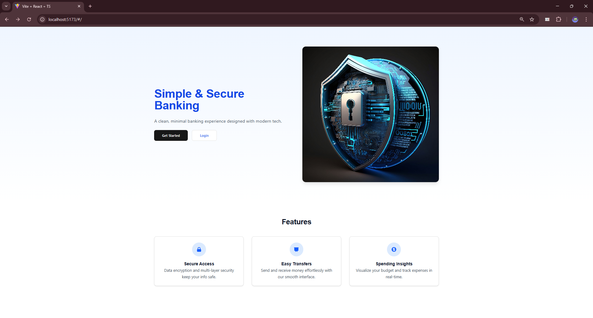

# 💳 Online Banking Application – FinTech Software

An end-to-end **Online Banking System** that mimics real-world banking platforms like ICICI, BOI, or HDFC. This system allows users to securely sign up, authenticate, send/receive money, and visualize transaction history. It also includes an advanced **Fraud Detection System** to identify suspicious transactions based on historical patterns.

---

## 📚 Table of Contents

- [🔧 System Architecture](#-system-architecture)
- [🚀 Features](#-features)
- [📂 Project Structure](#-project-structure)
- [🔐 Authentication & Security](#-authentication--security)
- [🐳 Docker Setup](#-docker-setup)
- [🛠️ Getting Started](#-getting-started)
- [📦 Tech Stack](#-tech-stack)
- [🖼️ Application Screenshots](#️-application-screenshots)
- [📊 Fraud Detection System](#-fraud-detection-system)
- [🤝 Contributors](#-contributors)
- [📎 Useful Links](#-useful-links)

---

## 🔧 System Architecture

Before development, we invested several weeks designing a robust architecture covering:

- ✅ Functional & Non-Functional Requirements
- 🧬 High-Level Design (HLD)
- 🛠️ Low-Level Design (LLD)
- 🔄 Sequence Diagrams & Flow Diagrams

📌 **[Design Docs & Diagrams](https://app.eraser.io/workspace/CXMV5NsTickZUMIarl8n?origin=share)**

---

## 🚀 Features

### ✅ Backend (Spring Boot + RabbitMQ)

- JWT-based secure login/signup
- Asynchronous transaction processing via RabbitMQ
- Endpoints for user data, transactions, and token validation
- API weight limiting and pagination support

### 🎨 Frontend (Vite + React + TypeScript)

- Fully responsive & modern UI using TailwindCSS and ShadCN
- Signup/Login, Dashboard, Transaction History
- Money Transfer (Send/Receive) with real-time feedback
- Reusable components and modular code structure

### 🔍 Fraud Detection

- Machine Learning model that predicts fraud based on transaction patterns
- REST API for integrating predictions into transaction flow
- Built with Python + Flask and explained with Google Gemini

---

## 📂 Project Structure

```bash
FinTech-Software/
│
├── java_backend/
├── Online-Banking-Application-Frontend/
├── ML-Model-For-Fraud-Detection-and-Risk-Analysis-API/
```

---

## 🔐 Authentication & Security

- Implemented full token-based security (JWT + Refresh Tokens)
- Secure password storage using hashing
- API protection via route-level guards
- Session timeout and token expiry handling

---

## 🐳 Docker Setup

To ensure a consistent and collaborative development environment for all team members, we used **Docker Compose** to bundle our backend environment into a single unit.

### 🧱 Docker Images Used:

- `java_backend-backend:latest` — Spring Boot backend
- `mysql:8` — Database container
- `rabbitmq:3-management` — Queue for async transactions

### 🧩 Docker Compose Container:

All the above services are composed into one container named: `java_backend`

### ▶️ Run Docker Compose

```bash
docker compose up -d
```

- This command will build the services and run them on the specified ports if not already available.
- Ensures backend + MySQL + RabbitMQ services are networked and running.

> **📌 Prerequisite**: Docker must be installed and running on your system.

---

## 🛠️ Getting Started

Here’s how to set up each part of the application.

### ✅ Backend Setup (Spring Boot + Docker)

> 📌 Prerequisites: Docker must be installed

1. Clone the backend repo:

   ```bash
   git clone https://github.com/FinTech-Software/java_backend.git
   cd java_backend
   ```

2. Run Docker Compose:

   ```bash
   docker compose up -d
   ```

This command builds the `java_backend` container and spins up all services (`Spring Boot`, `MySQL`, `RabbitMQ`) in one go.

---

### ✅ Frontend Setup (React + Vite + TypeScript)

> 📌 Prerequisite: Node.js (v18+) installed

1. Clone the frontend repo:

   ```bash
   git clone https://github.com/FinTech-Software/Online-Banking-Application-Frontend.git
   cd Online-Banking-Application-Frontend
   ```

2. Install dependencies:

   ```bash
   npm install
   ```

3. Start the development server:

   ```bash
   npm run dev
   ```

---

### ✅ ML Model Setup

The fraud detection model is containerized and built with Flask.
Please refer to the dedicated [README](https://github.com/FinTech-Software/ML-Model-For-Fraud-Detection-and-Risk-Analysis-API/blob/main/README.md) for setup and usage instructions.

---

## 📦 Tech Stack

| Layer         | Technology Used                        |
| ------------- | -------------------------------------- |
| Backend       | Spring Boot, MySQL, RabbitMQ, Java     |
| Frontend      | React, TypeScript, Vite, TailwindCSS   |
| ML Model      | Python, Flask, Scikit-learn, Pandas    |
| Auth/Security | JWT, Refresh Tokens, BCrypt            |
| DevOps        | Docker, Docker Compose, GitHub Actions |

---

## 🖼️ Application Screenshots

| 🧩 **Feature**                                    | 📸 **Screenshot**                                                                    |
| ------------------------------------------------- | ------------------------------------------------------------------------------------ |
| 🠠**Home Screen**                                |                                       |
| 📠**Signup**                                     |                                              |
| 🔠**Login**                                      |                                                |
| 📊 **Dashboard**                                  |                                        |
| 💸 **Send Money**                                 |                                      |
| 📈 **Recent Transactions**                        |                                  |
| 📋 **All Transactions**                           |                                  |
| 📉 **ML Model – Fraud Transaction Detected**      |       |
| 📈 **ML Model – Legitimate Transaction Detected** |  |
| 🤖 **AI Model – Fraud Transaction Detected**      |       |
| 🧾 **AI Model – Legitimate Transaction Detected** |  |

---

## 📊 Fraud Detection System

We developed a machine learning model capable of detecting fraudulent transactions using patterns in past data.

### ✅ Features:

- Binary classification (Fraud vs Legitimate)
- RESTful API in Flask
- Google Gemini AI integration to explain predictions
- Real-time integration with backend for fraud alerts

📘 **[Fraud Detection README](https://github.com/FinTech-Software/ML-Model-For-Fraud-Detection-and-Risk-Analysis-API/blob/main/README.md)**

---

## 🤝 Contributors

| Name                                                     | Role                                                                          |
| -------------------------------------------------------- | ----------------------------------------------------------------------------- |
| [Mohammed Varaliya](https://github.com/Mohammedvaraliya) | Project Lead, Backend, Frontend, ML Model & Integration, UI/UX, System Design |
| [Vraj Shah](https://github.com/v4vraj)                   | Project Lead, Backend Development, Docker, Frontend, UI/UX, System Design     |
| [Jayesh Mal](https://github.com/Jayesh25-trade)          | UI/UX, Frontend                                                               |

---

## 📎 Useful Links

- 🔗 Backend Repo: [java_backend](https://github.com/FinTech-Software/java_backend)
- 🔗 Frontend Repo: [Online-Banking-Application-Frontend](https://github.com/FinTech-Software/Online-Banking-Application-Frontend)
- 🔗 ML Fraud Detection: [ML Fraud API](https://github.com/FinTech-Software/ML-Model-For-Fraud-Detection-and-Risk-Analysis-API)
- 🔗 System Design Workspace: [Design Docs](https://app.eraser.io/workspace/CXMV5NsTickZUMIarl8n?origin=share)

---
